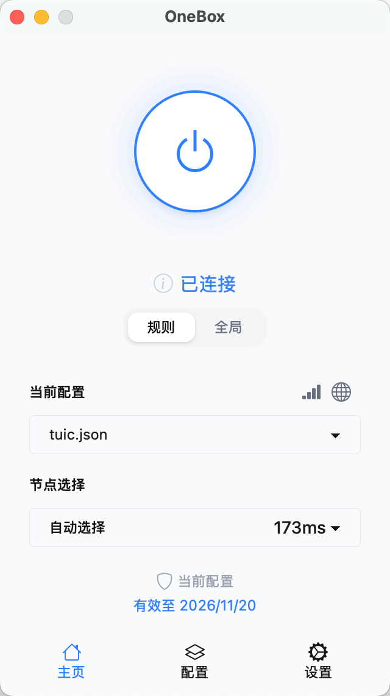
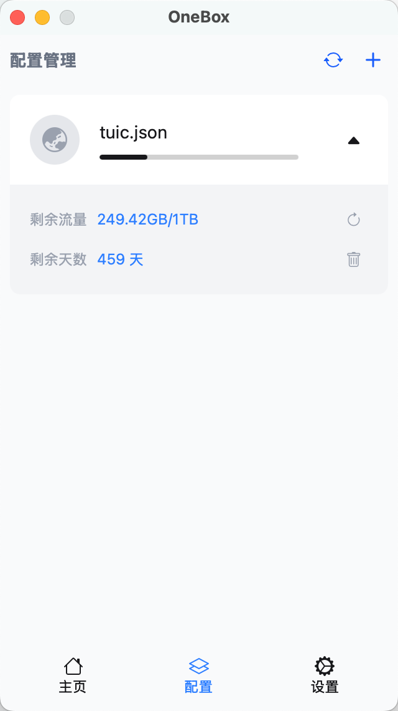
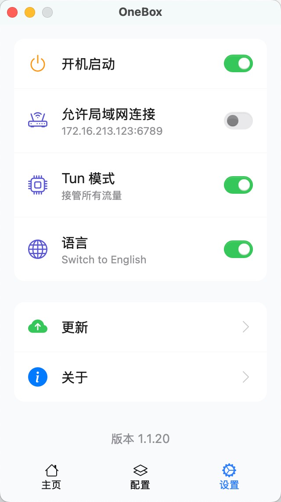

# OneBox

基于 sing-box 内核的跨平台 GUI 客户端。

## 软件截图 

||||
|:---:|:---:|:---:|

## 核心宗旨

**简单，稳定，安全。无需复杂配置，开箱即用**

需要高级定制功能的用户可考虑以下项目：

- https://github.com/libnyanpasu/clash-nyanpasu
- https://github.com/clash-verge-rev/clash-verge-rev
- https://github.com/2dust/v2rayN

## 下载安装 

请访问我们的[发布页面](https://github.com/OneOhCloud/OneBox/releases)获取最新版本。

